# OTA Lah - Real-time Transportation App

## Purpose

OTA Lah is a transformative real-time group transportation app designed specifically for the unique commuting challenges of Singapore. Its key features include:

- **Party Mode for Group Travel**: Facilitates synchronized group travel by calculating individualized departure times and providing real-time location and weather updates.
- **Minimizing Outdoor Waiting**: Integrates with the Singapore LTA API and Google Maps API to provide timely bus arrival information, reducing waiting time under harsh weather conditions.

By promoting more efficient and weather-aware bus commutes, OTA Lah encourages a shift from cars to public transport, aiding environmental conservation efforts.

## File Structure

Navigate through the project's structure using the links below:

- [Client Application](./Client)
- [Server Application](./Server)

## Deployment Instructions

### Setting Up the Server

1. Navigate to the server directory: `Server`
2. Install necessary dependencies.
3. Start the server by running `index.js`.

### Setting Up the Client

1. Navigate to the client directory: `cd Client`
2. Install the necessary dependencies.
3. Build the IOS version
4. Install the build on your device.

### Components

- **Client**: Handles user interface and interaction, communicates with the server for data.
- **Server**: Manages the backend logic, database interactions, and external API communications.

### Screenshots

    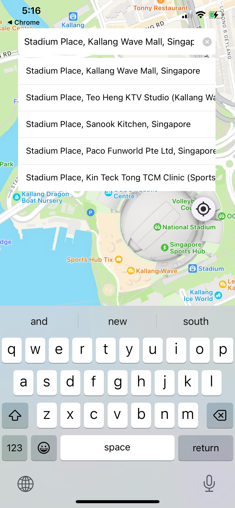
    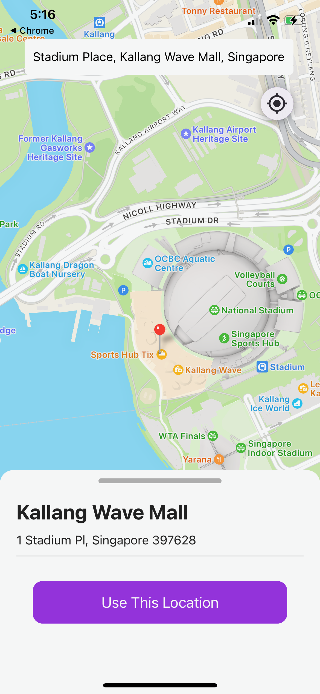
    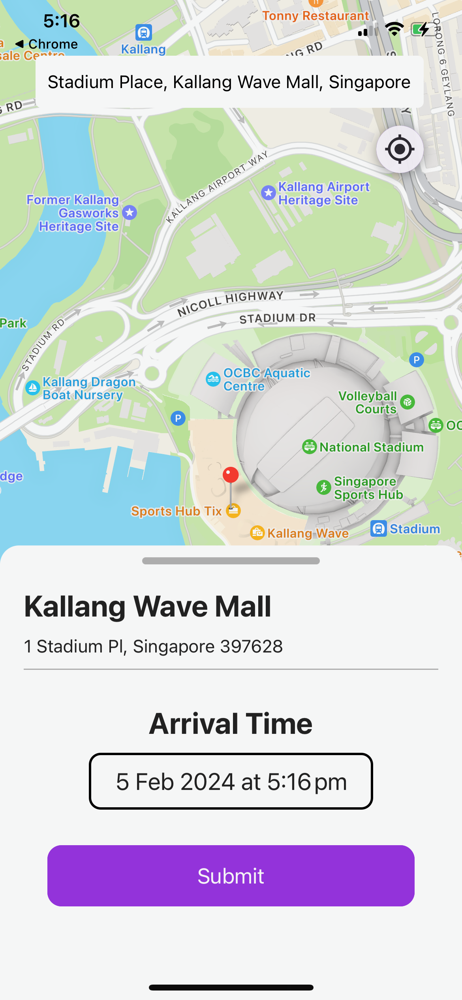

    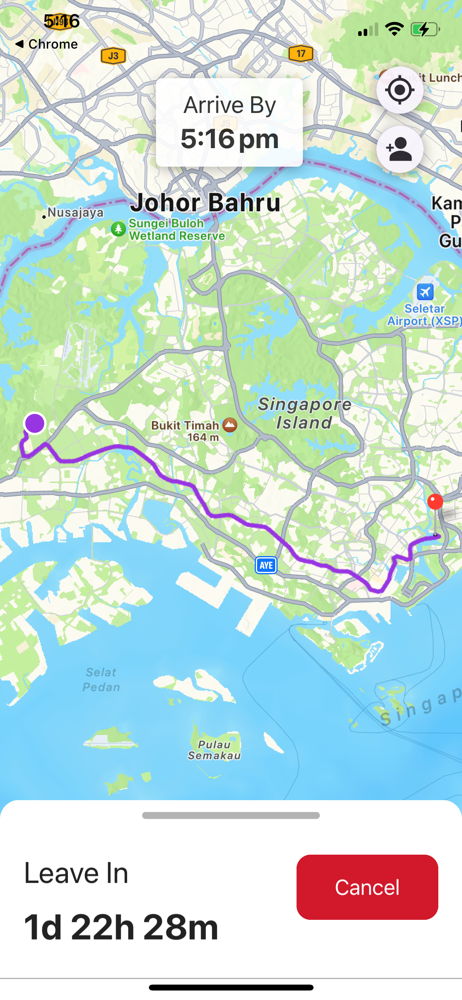
    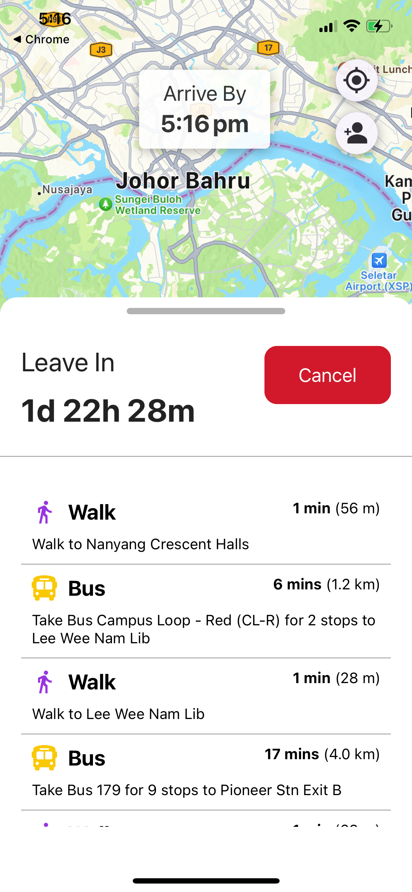
    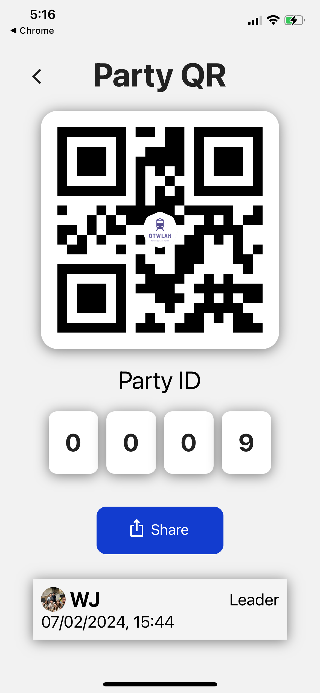

    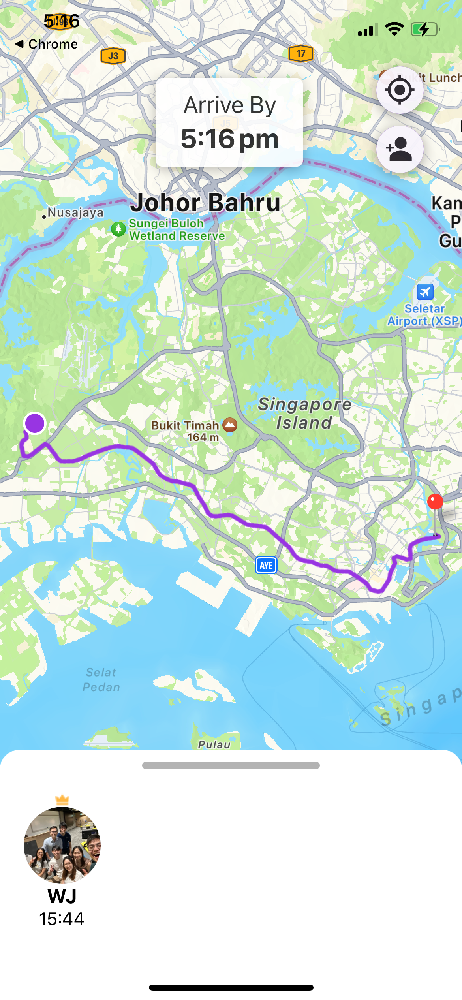
    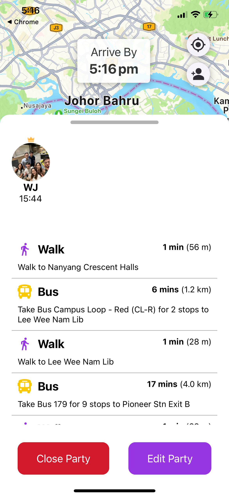
    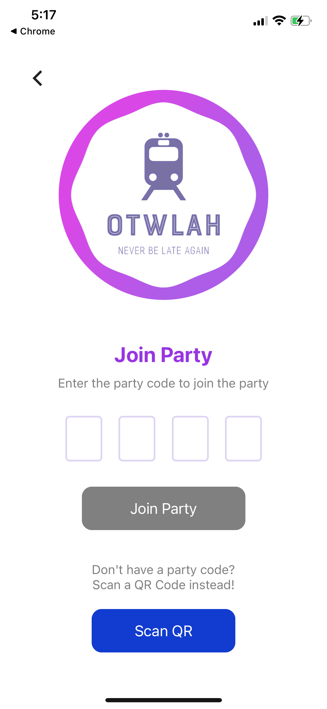

    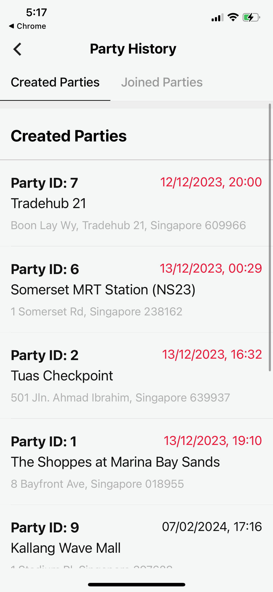
    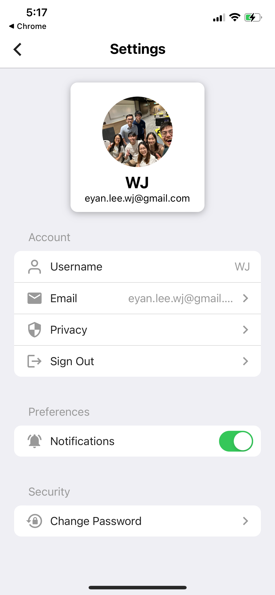

